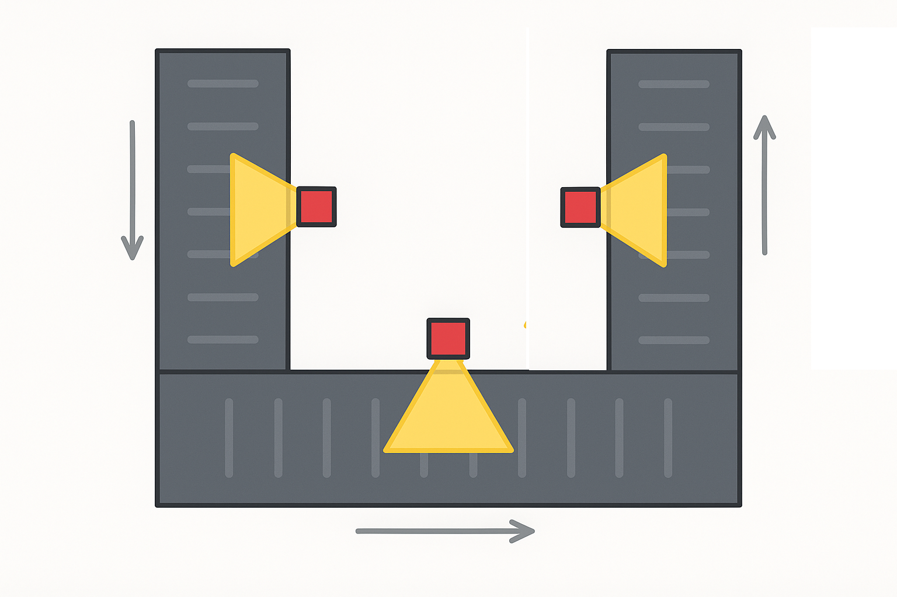
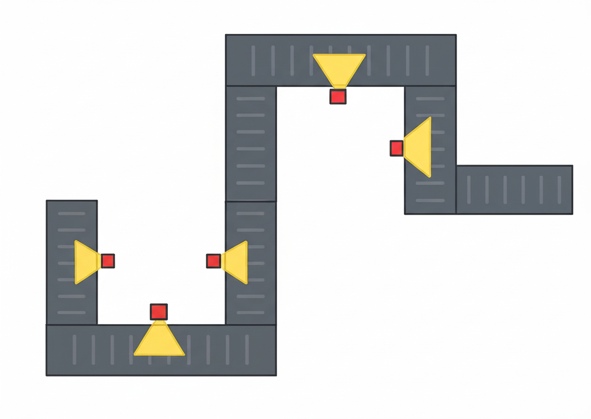
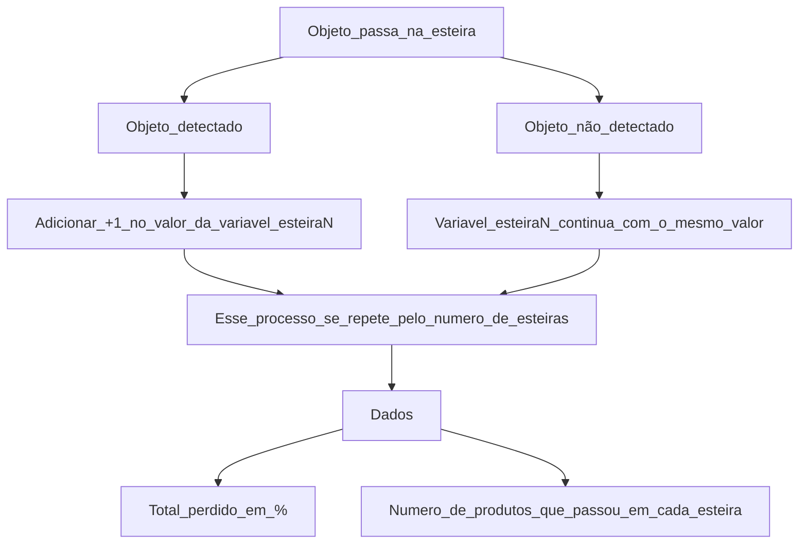

# Controle de Linha de Produção

## IFCE Campus Cedro

### Professor: Victor Sales

**Matéria:** Linguagem de Programação

### Equipe:

[Kayque Othon de Araújo Rolim](https://github.com/othonkayque)

[Jhonatas Ferreira de Matos](https://github.com/jhonatasxp)

<hr>

## Ideia Inicial

Projeto em C que simula uma linha de produção, onde os produtos que são perdidos ou danificados no meio do processo são detectados. Ao fim do algoritmo, é exibido na tela, em porcentagem, quantos produtos foram perdidos e em qual parte da linha de produção ocorreram mais perdas.



Nosso projeto foi pensado para poder ser replicado em linhas de produção de diferentes tamanhos




## Fluxograma da ideia



## O que o programa faz?

* Simula a passagem de 30 produtos por 3 esteiras.
* Gera uma perda aleatória de produtos em cada esteira (de 1 a 10).
* Mostra quantos produtos restaram após cada esteira.
* Informa qual esteira perdeu mais produtos.
* Calcula a porcentagem total de perda.

## Como rodar?

É necessário ter o MinGW (compilador de C) instalado no seu computador.

### Compilar e executar o código

```bash
gcc main.c -o executavel 
```
```bash
./executavel.exe
```

## Bibliotecas usadas

```c
stdio.h  
stdlib.h  
time.h
```

## Código documentado

### Includes

```c
#include <stdio.h>      // Permite mostrar informações na tela.
#include <stdlib.h>     // Permite usar funções como gerar números aleatórios.
#include <time.h>       // Ajuda a criar números aleatórios diferentes a cada vez.
```

### Variáveis

```c
#define TOTAL_ESPERADO 30 // Define o total inicial de produtos.
int esteira1 = 0, esteira2 = 0, esteira3 = 0; // Guarda a quantidade de produtos que passou em cada esteira.
int perda[3]; // Guarda quantos produtos foram perdidos em cada esteira.
```

### Funções `calculaPerdaTotal()` e `simulaEsteira()`

```c
// Calcula a perda total (em %) dos produtos durante toda a linha de produção
int calculaPerdaTotal(int valorInicial, int valorFinal) {
    int resultado = ((valorInicial - valorFinal) * 100) / valorInicial;
    return resultado;
}

// Simula a esteira recebendo os 30 produtos
int simulaEsteira() {
    int esteira = 0;
    for (int i = 0; i < TOTAL_ESPERADO; i++) {
        esteira = i;
    }
    return esteira;
}
```

### Função `simulaPerda()`

```c
// Gera perdas aleatórias entre 1 e 10 para cada esteira
void simulaPerda(int vetor[3]) {
    srand(time(NULL)); // Garante que os números mudem a cada execução.
    for (int i = 0; i < 3; i++) {
        vetor[i] = rand() % 10 + 1;
    }
}
```

### Função `verificaMaiorPerda()`

```c
// Informa qual esteira teve mais perdas
void verificaMaiorPerda() {
    if (perda[0] > perda[1] && perda[0] > perda[2]) {
        printf("O maior número de perdas foi na esteira 1\n");
    } else if (perda[1] > perda[0] && perda[1] > perda[2]) {
        printf("O maior número de perdas foi na esteira 2\n");
    } else if (perda[2] > perda[0] && perda[2] > perda[1]) {
        printf("O maior número de perdas foi na esteira 3\n");
    }
}
```

### Função principal

```c
// Função principal
int main() {
    esteira1 = simulaEsteira();
    esteira2 = simulaEsteira();
    esteira3 = simulaEsteira();

    simulaPerda(perda);

    esteira1 -= perda[0];           // Subtrai perdas da esteira 1
    esteira2 = esteira1 - perda[1]; // Esteira 2 começa do final da 1 e perde mais
    esteira3 = esteira2 - perda[2]; // Esteira 3 começa do final da 2 e perde mais

    system("cls"); // Limpa a tela (Windows)
    
    printf("\nSensor 1: %d produtos (%d produtos perdidos)\n", esteira1, perda[0]);
    printf("Sensor 2: %d produtos (%d produtos perdidos)\n", esteira2, perda[1]);
    printf("Sensor 3: %d produtos (%d produtos perdidos)\n", esteira3, perda[2]);

    verificaMaiorPerda();

    printf("Porcentagem perdida: %d%%\n\n", calculaPerdaTotal(TOTAL_ESPERADO, esteira3));

    system("pause"); // Espera o usuário apertar algo
    return 0;
}
```